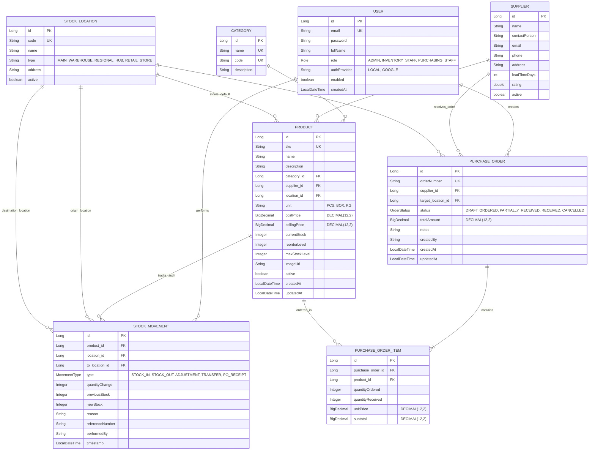

# Project Foresight - Database Entity Relationship (ER) Diagram

```mermaid
erDiagram
    USER ||--o{ STOCK_MOVEMENT : performs
    USER ||--o{ PURCHASE_ORDER : creates
    
    CATEGORY ||--o{ PRODUCT : categorizes
    SUPPLIER ||--o{ PRODUCT : supplies
    STOCK_LOCATION ||--o{ PRODUCT : stores_default
    
    PRODUCT ||--o{ STOCK_MOVEMENT : tracks_audit
    STOCK_LOCATION ||--o{ STOCK_MOVEMENT : origin_location
    STOCK_LOCATION ||--o{ STOCK_MOVEMENT : destination_location
    
    SUPPLIER ||--o{ PURCHASE_ORDER : receives_order
    STOCK_LOCATION ||--o{ PURCHASE_ORDER : ships_to
    
    PURCHASE_ORDER ||--|{ PURCHASE_ORDER_ITEM : contains
    PRODUCT ||--o{ PURCHASE_ORDER_ITEM : ordered_in

    USER {
        Long id PK
        String email UK
        String password
        String fullName
        Role role "ADMIN, INVENTORY_STAFF, PURCHASING_STAFF"
        String authProvider "LOCAL, GOOGLE"
        boolean enabled
        LocalDateTime createdAt
    }

    CATEGORY {
        Long id PK
        String name UK
        String code UK
        String description
    }

    SUPPLIER {
        Long id PK
        String name
        String contactPerson
        String email
        String phone
        String address
        int leadTimeDays
        double rating
        boolean active
    }

    STOCK_LOCATION {
        Long id PK
        String code UK
        String name
        String type "MAIN_WAREHOUSE, REGIONAL_HUB, RETAIL_STORE"
        String address
        boolean active
    }

    PRODUCT {
        Long id PK
        String sku UK
        String name
        String description
        Long category_id FK
        Long supplier_id FK
        Long location_id FK
        String unit "PCS, BOX, KG"
        BigDecimal costPrice "DECIMAL(12,2)"
        BigDecimal sellingPrice "DECIMAL(12,2)"
        Integer currentStock
        Integer reorderLevel
        Integer maxStockLevel
        String imageUrl
        boolean active
        LocalDateTime createdAt
        LocalDateTime updatedAt
    }

    STOCK_MOVEMENT {
        Long id PK
        Long product_id FK
        Long location_id FK
        Long to_location_id FK
        MovementType type "STOCK_IN, STOCK_OUT, ADJUSTMENT, TRANSFER, PO_RECEIPT"
        Integer quantityChange
        Integer previousStock
        Integer newStock
        String reason
        String referenceNumber
        String performedBy
        LocalDateTime timestamp
    }

    PURCHASE_ORDER {
        Long id PK
        String orderNumber UK
        Long supplier_id FK
        Long target_location_id FK
        OrderStatus status "DRAFT, ORDERED, PARTIALLY_RECEIVED, RECEIVED, CANCELLED"
        BigDecimal totalAmount "DECIMAL(12,2)"
        String notes
        String createdBy
        LocalDateTime createdAt
        LocalDateTime updatedAt
    }

    PURCHASE_ORDER_ITEM {
        Long id PK
        Long purchase_order_id FK
        Long product_id FK
        Integer quantityOrdered
        Integer quantityReceived
        BigDecimal unitPrice "DECIMAL(12,2)"
        BigDecimal subtotal "DECIMAL(12,2)"
    }
```
